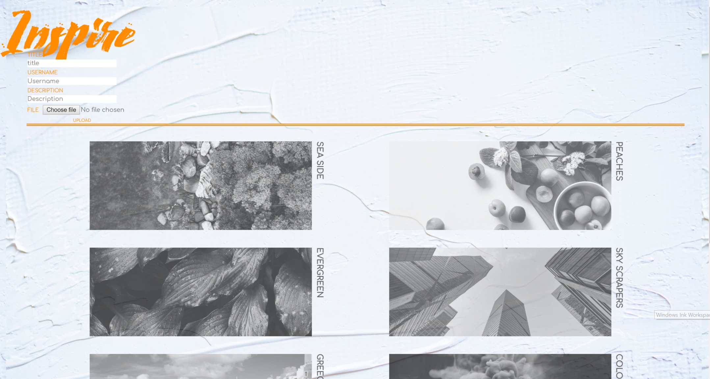
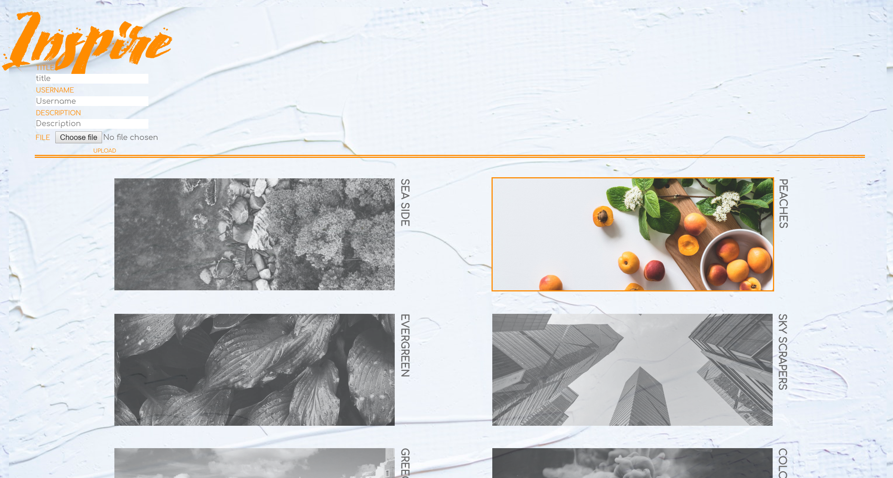
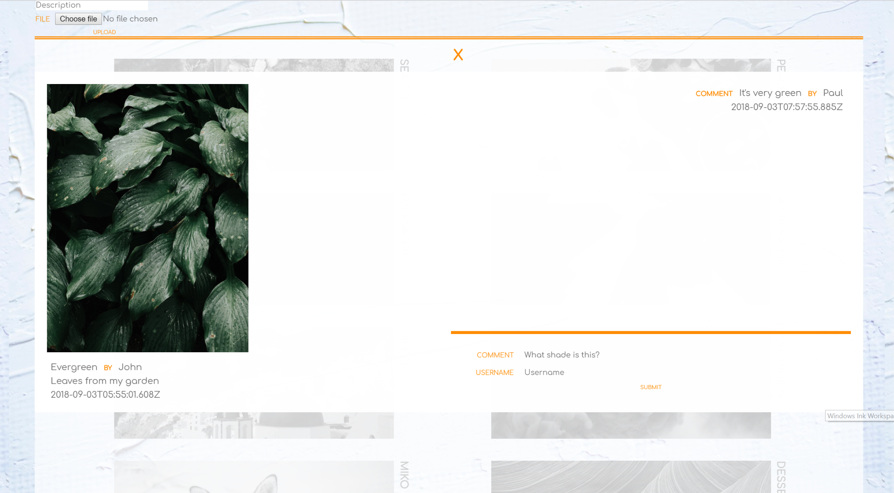

## Imageboard Project:

**Completion time:** 1 week

**Tech:** Vue & Aws3

**Functions:** instant image uploader function, instant comment function.

**Main Focus:**
learning how to incorporate file uploader function and the instant comment function.
It also have a more button at the bottom which will disappear if there are less than 8 pictures left in the database.
Once the image is clicked there will be a pop-up modal that will display the enlarged image and comment function.
Once the modal is up, the URL can be shared and the user would be directed to the correct image.

**Design:**
very minimal, 2 hues approach has been chosen for this project.
The background image is a canvas effect with paint slabs to give it some texture yet not distracting from the images.
Hints Tangerine colour was chosen as this will spark your imagination and also provides you with energy gives the user a sense of inspiration.
All of the images are uniform and grayscale to give it a sense of cleanliness.
The images then turn to their original colour and an orange boarder is displayed on the hovered item.
Note that the titles also change to the Tangerine colour once it is hovered on to give the user readability.

