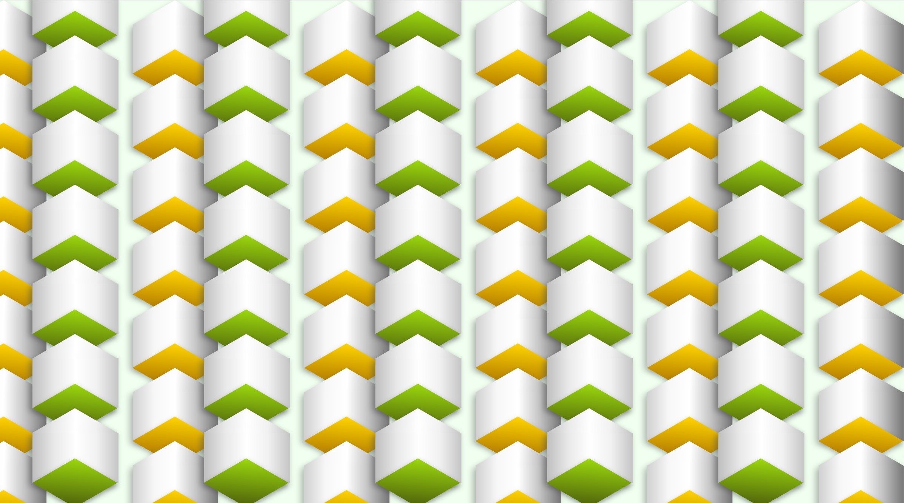

## [Box Background:](https://codepen.io/kgrim/pen/LqYgvj)

**Completion time:** 2 hours  

**Tech:** HTML & CSS  

**Main Focus:** Creating a 3D feel by using only the basics. With HTML I have created the divs and with CSS I have created shadows and depth.

**Design:** Chose the green and orange as I feel they energise the page and would be the pop of colour the page needs.

Check out the project live here; [Codepen](https://codepen.io/kgrim/pen/LqYgvj)

