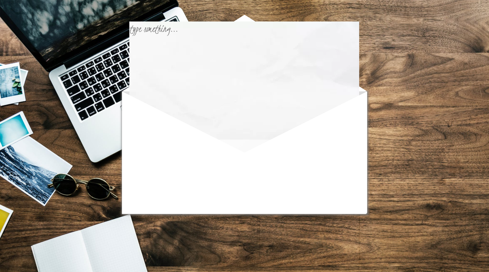
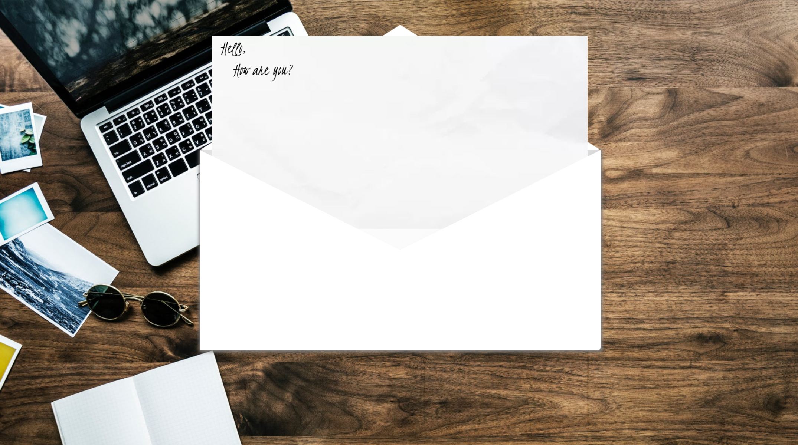

## [Envelope Note:](https://codepen.io/kgrim/pen/LMoLbY?editors=0100)

**Completion time:** 4 hours

**Tech:** jQuery

**Main Focus:**
When the user clicks on the envelope, the animation is removed and the envelope gets bigger. If the envelope flap is clicked, it would open the envelope and a piece of paper would slide for the user to type on it.

**Design:**
Went the cafe' vibe to make it a bit more playful and the text in a cursive font to feel like someone have written it out.

Check out the project live here; [Codepen](https://codepen.io/kgrim/pen/LMoLbY?editors=0100)

