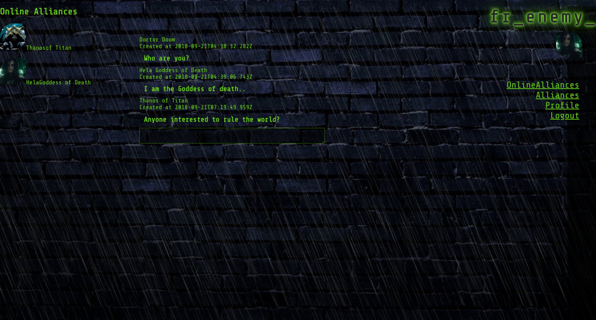
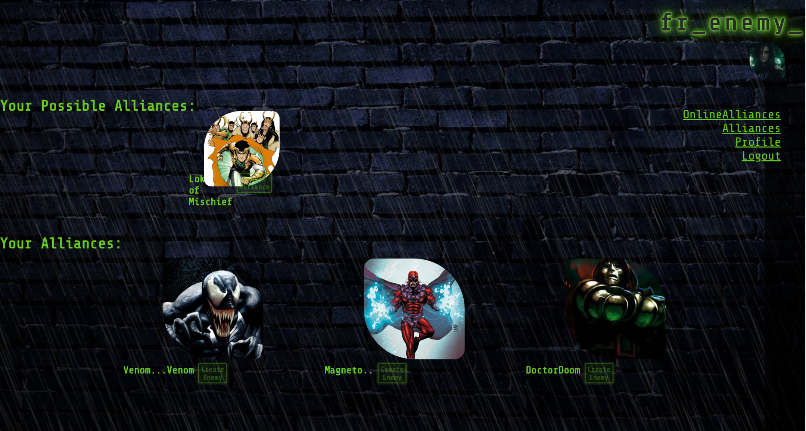
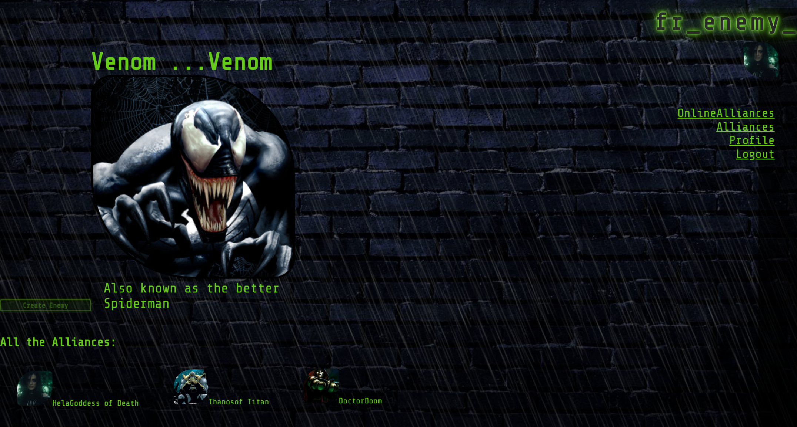
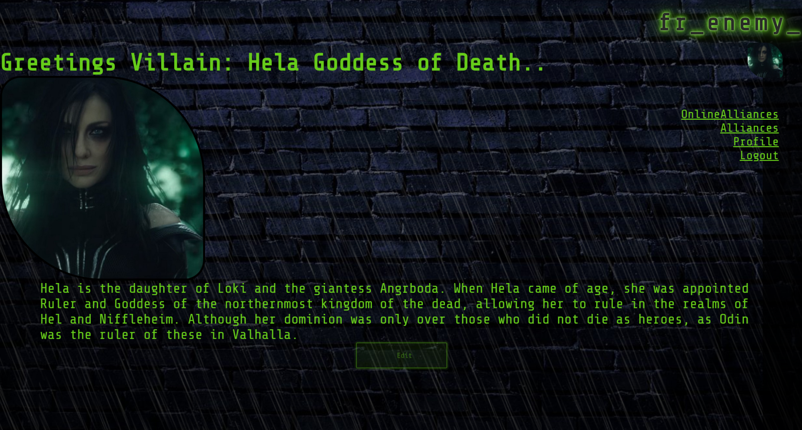
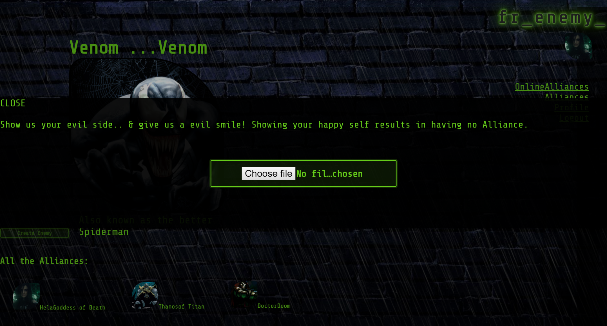
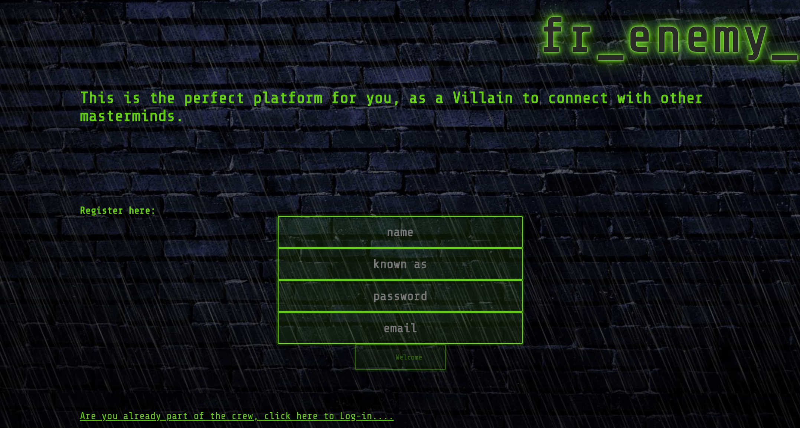

## Social Network Project:

**Completion time:** 2 weeks

**Tech:** React, Redux, Sockets & Aws3

**Functions:** log-in/sign-up, profile edit, image uploader, online/chat function, friend button, notification feature.

**Main Focus:**
there is a log-in/sign-up function in which the password is hashed and it would save the log-in in a cookie session.
Once the user sign-up, they would be directed to their profile where they can add an image and edit the bio.
Once the user log-in a notice is emitted to the other online users using sockets.io.
Sockets are also used when the users disconnects and whenever the user has an updated in regards the friendship status (yes, even if someone declined a friend request or unfriend you -- villains like drama).
The chat function will send an axios request to the server to get the latest 10 chats. The friendship button will change as soon as it is clicked and the database is updated accordingly.
All the images have a click event. If you are clicking on your image, a pop-up modal will be displayed to change your image.
If you are clicking on some other user image, it will direct you to their profile.

**Design:**
as this is the social network for the villains, the pop colour must be poison green!
The whole ecstatic is dark/mysterious and the background is on a brick wall, very similar to that found in alleyways as these are the parts most villains meet up.
There are noticeable visual/sound features.
These are: constant rain, flickering lighting/neon-lights, rolling thunder sounds and the images pictures are displayed as the shape of the eye that flickers once hovered on.
The text is given the same pop of colour that contrasts with the background which makes it feel like these hacker
devices villains may use to be off the radar.

